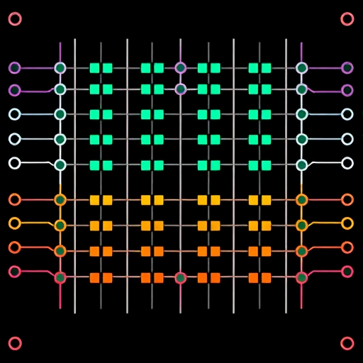

# Memristor Xbar for Neuromorphic Applications

<p style="text-align: center;">
    
</p>


This project implements a memristor crossbar model inspired by the [JART VCM1 memristor model](https://emrl.de/JART.html). The model is designed for neuromorphic computing applications, where memristors are used as artificial synapses in spiking neural networks (SNNs). The output is processed by adaptive leaky integrate-and-fire (AdLIF) neurons, enabling learning and inference capabilities.

## Key Features

- **Memristor Model**: Based on the JART VCM1 model, providing realistic analog memristive behavior.
- **Crossbar Array**: A scalable crossbar architecture to demonstrate neuromorphic synaptic connections.
- **Adaptive Leaky Integrate-and-Fire Neurons**: Implements AdLIF neurons to process spiking outputs for learning.
- **Visualization**: Includes plots for memristor behavior, neuron spikes, and network dynamics.

## Requirements

- SystemVerilog for modeling the memristor and crossbar.
- Python for simulations, visualizations, and neuron modeling.
- MATLAB/Octave (optional) for additional analysis and visualization.

## Installation

1. Clone this repository:
   ```bash
   git clone https://github.com/your-repo/memristor-crossbar.git
   ```

## References

1. [F. Cueppers et al., "Exploiting the switching dynamics of HfO2-based ReRAM devices for reliable analog memristive behavior," APL Materials 7 091105 (2019)](https://doi.org/10.1063/1.5108654).

2. Adaptive Leaky Integrate-and-Fire Neurons: Refer to related papers for details on SNN dynamics and implementations.
